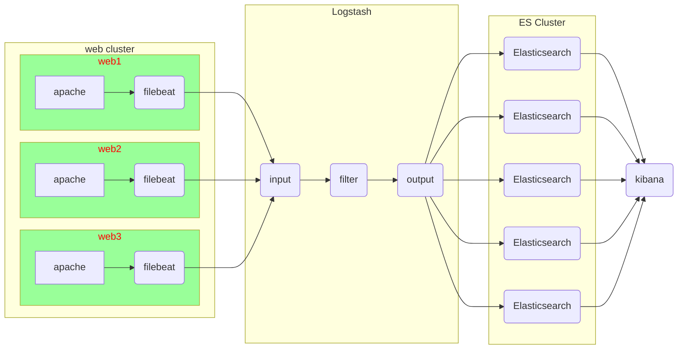
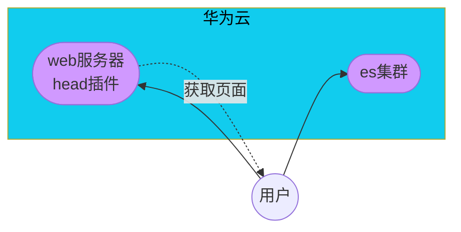

# ELK日志分析平台

## ELK架构图例




#### Elasticsearch 安装

###### 在跳板机上配置 yum 仓库

拷贝云盘 rpm-package/elk 目录到跳板机

```shell
[root@ecs-proxy ~]# cp -a elk /var/ftp/localrepo/elk
[root@ecs-proxy ~]# cd /var/ftp/localrepo/
[root@ecs-proxy localrepo]# createrepo --update .
```

###### 购买云主机 

| 主机    | IP地址       | 配置          |
| ------- | ------------ | ------------- |
| es-0001 | 192.168.1.41 | 最低配置2核2G |
| es-0002 | 192.168.1.42 | 最低配置2核2G |
| es-0003 | 192.168.1.43 | 最低配置2核2G |
| es-0004 | 192.168.1.44 | 最低配置2核2G |
| es-0005 | 192.168.1.45 | 最低配置2核2G |

###### 单机安装

```shell
[root@es-0001 ~]# vim /etc/hosts
192.168.1.41	es-0001
[root@es-0001 ~]# yum install -y java-1.8.0-openjdk elasticsearch
[root@es-0001 ~]# vim /etc/elasticsearch/elasticsearch.yml
55:  network.host: 0.0.0.0
[root@es-0001 ~]# systemctl enable --now elasticsearch
[root@es-0001 ~]# curl http://192.168.1.41:9200/
{
  "name" : "War Eagle",
  "cluster_name" : "elasticsearch",
  "version" : {
    "number" : "2.3.4",
    "build_hash" : "e455fd0c13dceca8dbbdbb1665d068ae55dabe3f",
    "build_timestamp" : "2016-06-30T11:24:31Z",
    "build_snapshot" : false,
    "lucene_version" : "5.5.0"
  },
  "tagline" : "You Know, for Search"
}
```

###### 集群安装

es-0001 ... es-0005 所有主机，都要执行以下操作

```shell
[root@es-0001 ~]# vim /etc/hosts
192.168.1.41	es-0001
192.168.1.42	es-0002
192.168.1.43	es-0003
192.168.1.44	es-0004
192.168.1.45	es-0005
[root@es-0001 ~]# yum install -y java-1.8.0-openjdk elasticsearch
[root@es-0001 ~]# vim /etc/elasticsearch/elasticsearch.yml
17:  cluster.name: my-es
23:  node.name: es-0001 # 本机主机名
55:  network.host: 0.0.0.0
68:  discovery.zen.ping.unicast.hosts: ["es-0001", "es-0002"]
[root@es-0001 ~]# systemctl enable --now elasticsearch
[root@es-0001 ~]# curl http://192.168.1.41:9200/_cluster/health?pretty
{
  "cluster_name" : "my-es",
  "status" : "green",
  "timed_out" : false,
  "number_of_nodes" : 5,
  "number_of_data_nodes" : 5,
   ... ...
}
```

###### 插件安装

插件原理图




购买云主机

| 主机 | IP地址       | 配置          |
| ---- | ------------ | ------------- |
| web  | 192.168.1.48 | 最低配置1核1G |

安装 apache，并部署 head 插件

```shell
[root@web ~]# yum install -y httpd
[root@web ~]# tar zxf head.tar.gz
[root@web ~]# mv elasticsearch-head /var/www/html/head
[root@web ~]# systemctl enable --now httpd
Created symlink from /etc/systemd/system/multi-user.target.wants/httpd.service to /usr/lib/systemd/system/httpd.service.
[root@web ~]# 
```

使用华为 ELB， 把 web 服务和 es-0001 的 9200 端口发布到互联网，并通过浏览器访问

es-0001 访问授权

```shell
[root@es-0001 ~]# vim /etc/elasticsearch/elasticsearch.yml
# 配置文件最后追加
http.cors.enabled : true
http.cors.allow-origin : "*"
http.cors.allow-methods : OPTIONS, HEAD, GET, POST, PUT, DELETE
http.cors.allow-headers : X-Requested-With,X-Auth-Token,Content-Type,Content-Length
[root@es-0001 ~]# systemctl restart elasticsearch.service 
```

使用插件访问 es 集群服务

#### Elasticsearch基本操作

###### 查询_cat方法

```shell
# 查询支持的关键字
[root@es-0001 ~]# curl -XGET http://es-0001:9200/_cat/
# 查具体的信息
[root@es-0001 ~]# curl -XGET http://es-0001:9200/_cat/master
# 显示详细信息 ?v
[root@es-0001 ~]# curl -XGET http://es-0001:9200/_cat/master?v
# 显示帮助信息 ?help
[root@es-0001 ~]# curl -XGET http://es-0001:9200/_cat/master?help
```

###### 创建索引

指定索引的名称，指定分片数量，指定副本数量

创建索引使用 PUT 方法，创建完成以后通过 head 插件验证

```shell
[root@es-0001 ~]# curl -XPUT -H "Content-Type: application/json" http://es-0001:9200/tedu -d \
'{
    "settings":{
       "index":{
          "number_of_shards": 5, 
          "number_of_replicas": 1
       }
    }
}'
```

###### 增加数据

```shell
[root@es-0001 ~]# curl -XPUT -H "Content-Type: application/json" http://es-0001:9200/tedu/teacher/1 -d \
'{
  "职业": "诗人",
  "名字": "李白",
  "称号": "诗仙",
  "年代": "唐"
}' 
```

###### 查询数据

```shell\
[root@es-0001 ~]# curl -XGET http://es-0001:9200/tedu/teacher/1?pretty
```

###### 修改数据

```shell\
[root@es-0001 ~]# curl -XPOST -H "Content-Type: application/json" \
                  http://es-0001:9200/tedu/teacher/1/_update -d '{ "doc": {"年代":"公元701"}}'
```

###### 删除数据

```shell
# 删除一条
[root@es-0001 ~]# curl -XDELETE -H "Content-Type: application/json" http://es-0001:9200/tedu/teacher/1
# 删除索引
[root@es-0001 ~]# curl -XDELETE -H "Content-Type: application/json" http://es-0001:9200/tedu
```

#### kibana安装

###### 购买云主机 

| 主机   | IP地址       | 配置          |
| ------ | ------------ | ------------- |
| kibana | 192.168.1.46 | 最低配置1核1G |

###### 安装kibana

```shell
[root@kibana ~]# vim /etc/hosts
192.168.1.41	es-0001
192.168.1.42	es-0002
192.168.1.43	es-0003
192.168.1.44	es-0004
192.168.1.45	es-0005
192.168.1.46	kibana
[root@kibana ~]# yum install -y kibana
[root@kibana ~]# vim /etc/kibana/kibana.yml
02  server.port: 5601
07  server.host: "0.0.0.0"
28  elasticsearch.hosts: ["http://es-0002:9200", "http://es-0003:9200"]
37  kibana.index: ".kibana"
40  kibana.defaultAppId: "home"
113 i18n.locale: "zh-CN"
[root@kibana ~]# systemctl enable --now kibana
```

绑定弹性公网IP，通过 WEB 浏览器验证

###### 导入日志数据

拷贝云盘 logs.jsonl.gz 到跳板机

```shell
[root@ecs-proxy ~]# gunzip logs.jsonl.gz 
[root@ecs-proxy ~]# curl -XPOST -H "Content-Type: application/json" http://192.168.1.41:9200/_bulk --data-binary @logs.jsonl 
```

