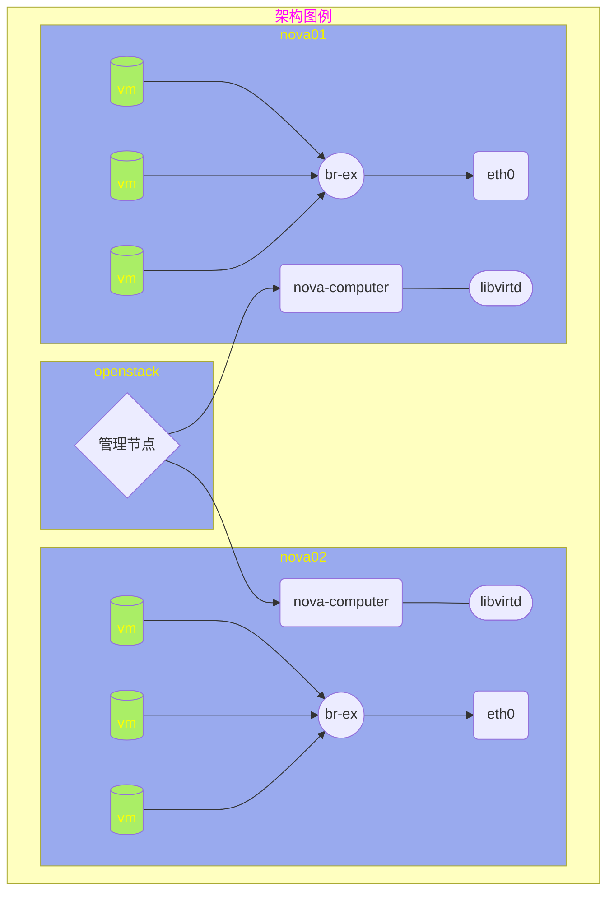

# 私有云管理

## openstack 实验架构图例


## openstack初始化

| 主机名称  |    IP地址    |   角色   |
| :-------: | :----------: | :------: |
| openstack | 192.168.1.10 | 管理节点 |
|  nova01   | 192.168.1.11 | 计算节点 |
|  nova02   | 192.168.1.12 | 计算节点 |

#### 1、windows系统

​      导入教学环境镜像到 E:\ 下

​      配置网卡连接 vmnet8、配置系统光盘路径

​      启动三台虚拟机 openstack、nova01、nova02

#### 2、linux系统

```shell
[root@localhost ~]# base-vm initvm openstack
patching file nova01.xml
patching file nova02.xml
patching file openstack.xml
Domain openstack started                                   [  OK  ]
Domain nova01 started                                      [  OK  ]
Domain nova02 started                                      [  OK  ]
[root@localhost ~]# virsh list
 Id    Name                           State
----------------------------------------------------
 1     openstack                      running
 2     nova01                         running
 3     nova02                         running
 [root@localhost ~]# 
```


## 登录 openstack

#### Web页面登录

浏览器访问 http://192.168.1.10/

#### 命令行登录

```shell
[root@openstack ~]# openstack user list
Missing value auth-url required for auth plugin password
# 没有登录获取数据失败
[root@openstack ~]# source keystonerc_admin 
[root@openstack ~(keystone_admin)]# openstack user list
+----------------------------------+---------+
| ID                               | Name    |
+----------------------------------+---------+
| 0e5367062de6478a9fe2d0456cb5fddb | nova    |
| 27191744bc6349f5b34822c083f7874e | admin   |
| 803074aab6fe49a19b983d9fbb7322be | glance  |
| cf35dd75778d4479965e2f39771956de | neutron |
| d5f4ffae68e54210a6bb29fba36acaaa | cinder  |
+----------------------------------+---------+
# 登录以后获取数据成功
```


# 总结

    Horizon  组件,提供web管理界面
    Keystone 组件,提供集中的认证和授权
    Nova     组件,计算节点创建管理云主机
    Glance   组件,管理云主机镜像
    Swift    组件,存储云使用的对象存储服务
    Neutron  组件,管理云服务的内部、外部网络路由等
    Cinder   组件,管理云主机的存储卷服务


