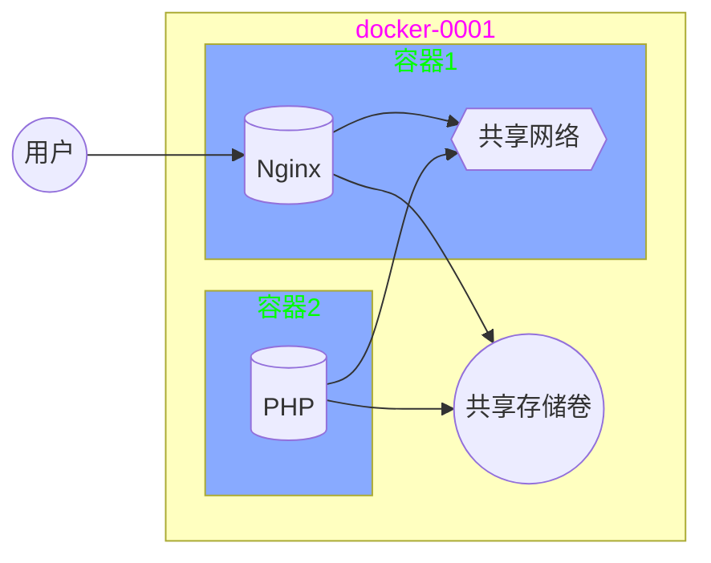
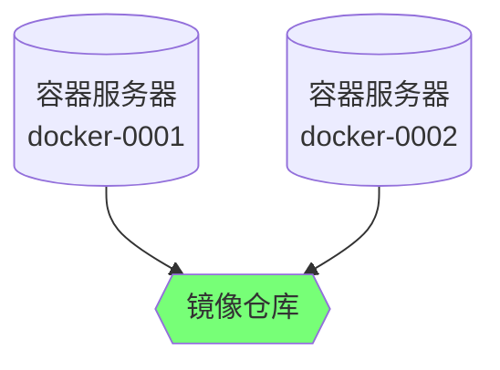

# 容器技术 -- 2

## 镜像管理

#### commit 打包镜像

docker  commit  容器id  新镜像名称:标签

```shell
[root@docker-0001 ~]# docker run -it centos:latest
[root@02fd1719c038 ~]# rm -f /etc/yum.repos.d/*.repo
[root@02fd1719c038 ~]# curl -o /etc/yum.repos.d/CentOS-Base.repo http://mirrors.myhuaweicloud.com/repo/CentOS-Base-7.repo
[root@02fd1719c038 ~]# yum install -y net-tools vim-enhanced tree bash-completion iproute psmisc && yum clean all
[root@02fd1719c038 ~]# exit
[root@docker-0001 ~]# docker commit 02fd1719c038 myos:latest
```

#### Dockerfile打包镜像

###### Dockerfile语法

| 语法指令 | 语法说明                              |
| -------- | ------------------------------------- |
| FROM     | 基础镜像                              |
| RUN      | 制作镜像时执行的命令，可以有多个      |
| ADD      | 复制文件到镜像，自动解压              |
| COPY     | 复制文件到镜像，不解压                |
| EXPOSE   | 声明开放的端口                        |
| ENV      | 设置容器启动后的环境变量              |
| WORKDIR  | 定义容器默认工作目录（等于cd）        |
| CMD      | 容器启动时执行的命令，仅可以有一条CMD |

###### 使用Dockerfile创建镜像

**docker  build  -t  镜像名称:标签  Dockerfile所在目录**


###### 制作apache镜像

CMD  指令可以查看 service 文件的启动命令 ExecStart（/lib/systemd/system/httpd.service）

ENV  环境变量查询服务文件中的环境变量配置文件 EnvironmentFile 指定的文件内容

```dockerfile
[root@docker-0001 ~]# mkdir apache; cd apache
[root@docker-0001 apache]# vim Dockerfile
FROM myos:latest
RUN  yum install -y httpd php
ENV  LANG=C
ADD  webhome.tar.gz  /var/www/html/
WORKDIR /var/www/html/
EXPOSE 80
CMD ["/usr/sbin/httpd", "-DFOREGROUND"]
# 拷贝 webhome.tar.gz 到当前目录中
[root@docker-0001 apache]# docker build -t myos:httpd .
```

查看与验证镜像

```shell
[root@docker-0001 web]# docker images
REPOSITORY          TAG                 IMAGE ID            CREATED             SIZE
myos                httpd               db15034569da        12 seconds ago      412MB
myos                latest              867409e412c8        2 hours ago         281MB
[root@docker-0001 web]# docker rm -f $(docker ps -aq)
[root@docker-0001 web]# docker run -itd myos:httpd
[root@docker-0001 web]# curl http://172.17.0.2/info.php
<pre>
Array
(
    [REMOTE_ADDR] => 172.17.0.1
    [REQUEST_METHOD] => GET
    [HTTP_USER_AGENT] => curl/7.29.0
    [REQUEST_URI] => /info.php
)
php_host: 	6c9e124bee1a
1229
```


###### 制作php-fpm镜像

```dockerfile
[root@docker-0001 ~]# mkdir php; cd php
[root@docker-0001 php]# vim Dockerfile
FROM myos:latest
RUN  yum install -y php-fpm
EXPOSE 9000
CMD ["/usr/sbin/php-fpm", "--nodaemonize"]
[root@docker-0001 php]# docker build -t myos:php-fpm .
```

验证服务

```shell
[root@docker-0001 ~]# docker run -itd myos:php-fpm
deb37734e52651161015e9ce7771381ee6734d1d36bb51acb176b936ab1b3196
[root@docker-0001 ~]# docker ps
CONTAINER ID        IMAGE               COMMAND                  CREATED             STATUS
deb37734e526        myos:php-fpm        "/usr/sbin/php-fpm -…"   17 seconds ago      Up 15 seconds       
[root@docker-0001 ~]# docker exec -it deb37734e526 /bin/bash
[root@deb37734e526 ~]# ss -ltun
Netid  State      Recv-Q 	Send-Q		Local Address:Port		 Peer Address:Port              
tcp    LISTEN     0      	128        			*:9000                  *:*                  
[root@deb37734e526 ~]# 
```

###### 制作nginx镜像

1、制作 nginx 软件包

```shell
[root@docker-0001 ~]# yum install -y gcc make pcre-devel openssl-devel
[root@docker-0001 ~]# useradd nginx
[root@docker-0001 ~]# tar -zxvf nginx-1.12.2.tar.gz
[root@docker-0001 ~]# cd nginx-1.12.2
[root@docker-0001 nginx-1.12.2]# ./configure --prefix=/usr/local/nginx --user=nginx --group=nginx --with-http_ssl_module
[root@docker-0001 nginx-1.12.2]# make && make install
[root@docker-0001 nginx-1.12.2]# # 拷贝 docker-images/info.html和info.php 到 nginx/html 目录下
[root@docker-0001 nginx-1.12.2]# cd /usr/local/
[root@docker-0001 local]# tar czf nginx.tar.gz nginx
```

2、制作镜像


```dockerfile
[root@docker-0001 local]# mkdir /root/nginx ;cd /root/nginx
[root@docker-0001 nginx]# cp /usr/local/nginx.tar.gz ./
[root@docker-0001 nginx]# vim Dockerfile 
FROM myos:latest
RUN  yum install -y pcre openssl && useradd nginx
ADD  nginx.tar.gz /usr/local/
EXPOSE 80
WORKDIR /usr/local/nginx/html
CMD  ["/usr/local/nginx/sbin/nginx", "-g", "daemon off;"]
[root@docker-0001 nginx]# docker build -t myos:nginx .
```

验证服务

```shell
[root@docker-0001 ~]# docker rm -f $(docker ps -aq)
deb37734e526
[root@docker-0001 ~]# docker run -itd myos:nginx
e440b53a860a93cc2b82ad0367172c344c7207def94c4c438027c60859e94883
[root@docker-0001 ~]# curl http://172.17.0.2/info.html
<html>
  <marquee  behavior="alternate">
      <font size="12px" color=#00ff00>Hello World</font>
  </marquee>
</html>
[root@docker-0001 ~]# 
```

#### 发布容器服务

###### 对外发布服务

给 docker-0001 绑定一个公网IP

docker  run  -itd  -p 宿主机端口:容器端口  镜像名称:标签

```shell
# 把 docker-0001 变成 apache 服务
[root@docker-0001 ~]# docker run -itd -p 80:80 myos:httpd

# 把 docker-0001 变成 nginx 服务，首先必须停止 apache
[root@docker-0001 ~]# docker stop $(docker ps -q)
[root@docker-0001 ~]# docker run -itd -p 80:80 myos:nginx
```

验证方式： 通过浏览器访问即可

###### 容器共享卷

docker  run  -itd  -v 宿主机对象:容器内对象  镜像名称:标签

使用共享卷动态修改容器内配置文件

```shell
[root@docker-0001 ~]# mkdir /var/webconf
[root@docker-0001 ~]# cp /usr/local/nginx/conf/nginx.conf /var/webconf/
[root@docker-0001 ~]# vim /var/webconf/nginx.conf
        location ~ \.php$ {
            root           html;
            fastcgi_pass   127.0.0.1:9000;
            fastcgi_index  index.php;
            include        fastcgi.conf;
        }
[root@docker-0001 ~]# docker run -itd -p 80:80 --name nginx \
                                 -v /var/webconf/nginx.conf:/usr/local/nginx/conf/nginx.conf myos:nginx
```

验证方式： 使用 exec 进入容器查看

```shell
[root@docker-0001 ~]# docker exec -it nginx /bin/bash
[root@e440b53a860a html]# cat /usr/local/nginx/conf/nginx.conf
[root@e440b53a860a html]# # 查看 php 相关配置是否被映射到容器内
```

###### 容器间网络通信

实验架构图例



实验步骤

```shell
[root@docker-0001 ~]# mkdir -p /var/{webroot,webconf}
[root@docker-0001 ~]# cd kubernetes/docker-images
[root@docker-0001 ~]# cp info.php info.html /var/webroot/
[root@docker-0001 ~]# cp /usr/local/nginx/conf/nginx.conf /var/webconf/
[root@docker-0001 ~]# vim /var/webconf/nginx.conf
        location ~ \.php$ {
            root           html;
            fastcgi_pass   127.0.0.1:9000;
            fastcgi_index  index.php;
            include        fastcgi.conf;
        }
# 启动前端 nginx 服务，并映射共享目录和配置文件
[root@docker-0001 ~]# docker run -itd --name nginx -p 80:80 \
      -v /var/webconf/nginx.conf:/usr/local/nginx/conf/nginx.conf \
      -v /var/webroot:/usr/local/nginx/html myos:nginx
# 启动后端 php 服务，并映射共享目录
[root@docker-0001 ~]# docker run -itd --network=container:nginx \
      -v /var/webroot:/usr/local/nginx/html myos:php-fpm
```

验证服务

```shell
[root@docker-0001 ~]# curl http://docker-0001/info.html
<html>
  <marquee  behavior="alternate">
      <font size="12px" color=#00ff00>Hello World</font>
  </marquee>
</html>
[root@docker-0001 ~]# curl http://docker-0001/info.php
<pre>
Array
(
    [REMOTE_ADDR] => 172.17.0.1
    [REQUEST_METHOD] => GET
    [HTTP_USER_AGENT] => curl/7.29.0
    [REQUEST_URI] => /info.php
)
php_host: 	f705f89b45f9
1229
```


#### docker私有仓库

###### docker私有仓库图例



###### 私有仓库配置

| 主机名   | ip地址        | 最低配置    |
| -------- | ------------- | ----------- |
| registry | 192.168.1.100 | 1CPU,1G内存 |

```shell
[root@registry ~]# yum install -y docker-distribution
[root@registry ~]# systemctl enable --now docker-distribution
[root@registry ~]# curl http://192.168.1.100:5000/v2/_catalog
{"repositories":[]}
```

###### docker客户端配置

所有node节点都需要配置，这里 docker-0001，docker-0002都要配置

native.cgroupdriver   cgroup驱动，docker默认 cgroupfs

registry-mirrors          默认下载仓库，使用国内源能快一点

insecure-registries     私有仓库地址（重点）

```shell
[root@docker-0001 ~]# vim /etc/docker/daemon.json
{
    "exec-opts": ["native.cgroupdriver=systemd"],
    "registry-mirrors": ["https://hub-mirror.c.163.com"],
    "insecure-registries":["192.168.1.100:5000", "registry:5000"]
}
[root@docker-0001 ~]# docker rm -f $(docker ps -aq)
[root@docker-0001 ~]# systemctl restart docker
```

###### 上传镜像

```shell
# 上传 myos:latest, myos:httpd, myos:nginx, myos:php-fpm
[root@docker-0001 ~]# docker tag myos:latest 192.168.1.100:5000/myos:latest
[root@docker-0001 ~]# docker push 192.168.1.100:5000/myos:latest
```

###### 验证测试

curl http://仓库IP:5000/v2/_catalog

curl http://仓库IP:5000/v2/镜像名称/tags/list

```shell
[root@docker-0002 ~]# curl http://192.168.1.100:5000/v2/_catalog
{"repositories":["myos"]}
[root@docker-0002 ~]# curl http://192.168.1.100:5000/v2/myos/tags/list
{"name":"myos","tags":["latest"]}
# 使用远程镜像启动容器
[root@docker-0002 ~]# docker run -it 192.168.1.100:5000/myos:latest
Unable to find image '192.168.1.100:5000/myos:latest' locally
latest: Pulling from myos
7dc0dca2b151: Pull complete 
95c297b4d705: Pull complete 
Digest: sha256:d61ffc053895e2dc16f63b8a2988dfe5f34207b48b1e74d397bb3267650ba4ce
Status: Downloaded newer image for 192.168.1.100:5000/myos:latest
[root@674ebe359e44 /]# 
```

