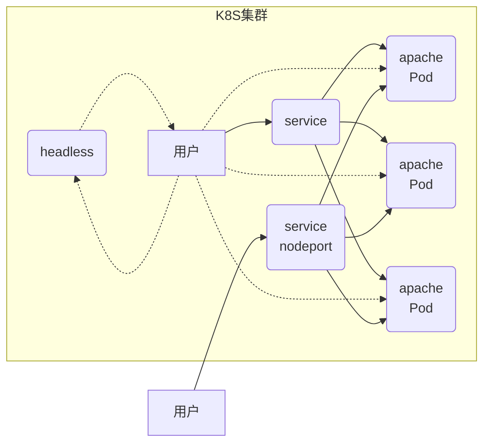

# kubernetes -- 03

## 资源控制器

#### daemonset 控制器

```yaml
[root@master ~]# vim mynginx.yaml
---
kind: DaemonSet
apiVersion: apps/v1
metadata:
  name: mynginx
spec:
  selector:
    matchLabels:
      myapp: nginx
  template:
    metadata:
      labels:
        myapp: nginx
    spec:
      containers:
      - name: nginxcluster
        image: 192.168.1.100:5000/myos:nginx
        stdin: false
        tty: false
        ports:
        - protocol: TCP
          containerPort: 80
      restartPolicy: Always

[root@master ~]# kubectl apply -f mynginx.yaml 
daemonset.apps/mynginx created
[root@master ~]# kubectl get pod -o wide
NAME            READY   STATUS    RESTARTS   AGE   IP            NODE
mynginx-77jtf   1/1     Running   0          6s    10.244.3.9    node-0001
mynginx-cwdzt   1/1     Running   0          6s    10.244.1.9    node-0003
mynginx-z2kl6   1/1     Running   0          6s    10.244.2.10   node-0002
[root@master ~]# 
```

#### 污点与容忍

污点策略：NoSchedule、PreferNoSchedule、NoExecute

```shell
[root@master ~]# kubectl delete -f mynginx.yaml 
daemonset.apps "mynginx" deleted
[root@master ~]# kubectl describe nodes |grep -P "^Taints"
Taints:             node-role.kubernetes.io/master:NoSchedule
Taints:             <none>
Taints:             <none>
Taints:             <none>
[root@master ~]# kubectl taint node node-0001 k1=v1:NoSchedule
node/node-0001 tainted
[root@master ~]# kubectl apply -f mynginx.yaml 
daemonset.apps/mynginx created
[root@master ~]# kubectl get pods
NAME            READY   STATUS    RESTARTS   AGE
mynginx-f2rxh   1/1     Running   0          4s
mynginx-n7xsw   1/1     Running   0          4s
[root@master ~]# kubectl taint node node-0001 k1-
node/node-0001 untainted
[root@master ~]# kubectl get pods
NAME            READY   STATUS    RESTARTS   AGE
mynginx-f2rxh   1/1     Running   0          105s
mynginx-hp6f2   1/1     Running   0          2s
mynginx-n7xsw   1/1     Running   0          105s
[root@master ~]# 
```

驱逐容器

```shell
[root@master ~]# kubectl apply -f myapache.yaml 
deployment.apps/myapache created
[root@master ~]# kubectl scale deployment myapache --replicas=3
deployment.apps/myapache scaled
[root@master ~]# kubectl get pod -o wide
NAME                       READY   STATUS    RESTARTS   AGE     IP            NODE
myapache-7d689bf8f-xq7l6   1/1     Running   0          2m23s   10.244.3.11   node-0001
myapache-7d689bf8f-b4d5f   1/1     Running   0          9s      10.244.2.14   node-0002
myapache-7d689bf8f-mzcgw   1/1     Running   0          9s      10.244.1.13   node-0003
mynginx-hp6f2              1/1     Running   0          5m25s   10.244.3.10   node-0001
mynginx-f2rxh              1/1     Running   0          7m8s    10.244.2.11   node-0002
mynginx-4f7tl              1/1     Running   0          20s     10.244.1.12   node-0003
[root@master ~]# kubectl taint node node-0003 k1=v1:NoExecute
node/node-0003 tainted
[root@master ~]# kubectl get pod -o wide
NAME                       READY   STATUS    RESTARTS   AGE     IP            NODE
myapache-7d689bf8f-xq7l6   1/1     Running   0          2m23s   10.244.3.11   node-0001
myapache-7d689bf8f-b4d5f   1/1     Running   0          9s      10.244.2.14   node-0002
myapache-7d689bf8f-mzcgw   1/1     Running   0          9s      10.244.2.15   node-0002
mynginx-hp6f2              1/1     Running   0          5m25s   10.244.3.10   node-0001
mynginx-f2rxh              1/1     Running   0          7m8s    10.244.2.11   node-0002
[root@master ~]# kubectl taint node node-0003 k1-
node/node-0003 untainted
[root@master ~]# kubectl get pod -o wide
NAME                       READY   STATUS    RESTARTS   AGE     IP            NODE
myapache-7d689bf8f-xq7l6   1/1     Running   0          2m23s   10.244.3.11   node-0001
myapache-7d689bf8f-b4d5f   1/1     Running   0          9s      10.244.2.14   node-0002
myapache-7d689bf8f-mzcgw   1/1     Running   0          9s      10.244.2.15   node-0002
mynginx-hp6f2              1/1     Running   0          5m25s   10.244.3.10   node-0001
mynginx-f2rxh              1/1     Running   0          7m8s    10.244.2.11   node-0002
mynginx-9s9z4              1/1     Running   0          34s     10.244.1.14   node-0003
[root@master ~]# 
```

#### job/cronjob 控制器

job 资源文件

```yaml
[root@master ~]# vim myjob.yaml
---
apiVersion: batch/v1
kind: Job
metadata:
  name: pi
spec:
  template:
    spec:
      containers:
      - name: pi
        image: 192.168.1.100:5000/myos:v1804
        command: ["perl",  "-Mbignum=bpi", "-wle", "print bpi(2000)"]
      restartPolicy: OnFailure
[root@master config]# kubectl apply -f myjob.yaml 
job.batch/pi created
[root@master config]# kubectl get job
NAME   COMPLETIONS   DURATION   AGE
pi     1/1           2s         7s
[root@master config]# kubectl get pod
NAME                     READY   STATUS      RESTARTS   AGE
pi-gvfwj                 0/1     Completed   0          15s
# 查看终端结果
[root@master config]# kubectl logs pi-gvfwj
```

cronjob 资源文件

```yaml
[root@master ~]# vim mycronjob.yaml 
---
apiVersion: batch/v1beta1
kind: CronJob
metadata:
  name: cronjob-pi
spec:
  schedule: "*/1 * * * *"
  jobTemplate:
    spec:
      template:
        spec:
          containers:
          - name: pi
            image: 192.168.1.100:5000/myos:v1804
            command: ["perl",  "-Mbignum=bpi", "-wle", "print bpi(2000)"]
          restartPolicy: OnFailure
[root@master ~]# kubectl apply -f mycronjob.yaml 
cronjob.batch/cronjob-pi created
[root@master ~]# kubectl get cronjobs.batch 
NAME         SCHEDULE      		SUSPEND   ACTIVE   	LAST SCHEDULE   AGE
cronjob-pi   */1 * * * *   		False     0        	<none>          10s
[root@master ~]# kubectl get pod
NAME                          	READY     STATUS      RESTARTS   	AGE
cronjob-pi-1595410620-vvztx   	0/1       Completed   0          	62s
```

## 集群服务

#### 服务图例



#### ClusterIP服务

###### 会变化的资源

```yaml
[root@master ~]# kubectl apply -f myapache.yaml 
deployment.apps/myapache created
[root@master ~]# kubectl scale deployment myapache --replicas=2
deployment.apps/myapache scaled
[root@master ~]# kubectl get pod -o wide
NAME                       READY   STATUS    RESTARTS   AGE   IP            NODE
myapache-7d689bf8f-c268l   1/1     Running   0          13s   10.244.2.16   node-0002
myapache-7d689bf8f-4z225   1/1     Running   0          5s    10.244.1.15   node-0003
[root@master ~]# kubectl delete pod myapache-7d689bf8f-4z225 
pod "myapache-7d689bf8f-4z225" deleted
[root@master ~]# kubectl get pod -o wide
NAME                       READY   STATUS    RESTARTS   AGE   IP            NODE
myapache-7d689bf8f-c268l   1/1     Running   0          38s   10.244.2.16   node-0002
myapache-7d689bf8f-mccqv   1/1     Running   0          13s   10.244.3.12   node-0001
[root@master ~]# 
```

###### 创建 ClusterIP 服务

```yaml
[root@master ~]# vim clusterip.yaml 
---
kind: Service
apiVersion: v1
metadata:
  name: myapache
spec:
  ports:
  - protocol: TCP
    port: 80
    targetPort: 80
  selector:
    myapp: httpd      # 标签必须与 deploy 资源文件中一致
  type: ClusterIP
[root@master config]# kubectl apply -f clusterip.yaml 
service/myapache created
[root@master config]# kubectl get service
NAME         TYPE        CLUSTER-IP       EXTERNAL-IP   PORT(S)   AGE
kubernetes   ClusterIP   10.254.0.1       <none>        443/TCP   22h
myapache     ClusterIP   10.254.235.248   <none>        80/TCP    4s
```

###### 访问服务

服务只有在集群内部才可以访问，创建 Pod，在Pod 中访问服务

```yaml
[root@master ~]# kubectl apply -f mypod.yaml 
pod/mypod created
[root@master ~]# kubectl exec -it mypod -- /bin/bash
[root@mypod /]# curl http://10.254.235.248/info.php
<pre>
Array
(
    [REMOTE_ADDR] => 10.244.1.16
    [REQUEST_METHOD] => GET
    [HTTP_USER_AGENT] => curl/7.29.0
    [REQUEST_URI] => /info.php
)
php_host: 	myapache-7d689bf8f-mccqv
1229
[root@mypod /]# curl http://10.254.235.248/info.php
<pre>
Array
(
    [REMOTE_ADDR] => 10.244.1.16
    [REQUEST_METHOD] => GET
    [HTTP_USER_AGENT] => curl/7.29.0
    [REQUEST_URI] => /info.php
)
php_host: 	myapache-7d689bf8f-c268l
1229
[root@mypod /]# 
```

扩容集群节点，服务自动扩展

```shell
# 在master上执行扩容节点
[root@master ~]# kubectl scale deployment myapache --replicas=3
# 服务本质是LVS规则
[root@master ~]# ipvsadm -L -n
TCP  10.254.235.248:80 rr
  -> 10.244.1.17:80               Masq    1      0          0         
  -> 10.244.2.16:80               Masq    1      0          0         
  -> 10.244.3.12:80               Masq    1      0          0        
-----------------------------------------------------------------------------------------
# 在pod里访问
[root@pod-example /]# curl http://10.254.78.148/info.php
... ...
php_host: 	myapache-7d689bf8f-lpt89
... ...
php_host: 	myapache-7d689bf8f-mccqv
... ...
php_host: 	myapache-7d689bf8f-c268l
```

#### nodeport 服务

```yaml
[root@master ~]# vim mynodeport.yaml 
---
kind: Service
apiVersion: v1
metadata:
  name: mynodeport
spec:
  ports:
  - protocol: TCP
    port: 80
    targetPort: 80
  selector:
    myapp: httpd
  type: NodePort     # 指定服务类型
[root@master ~]# kubectl apply -f mynodeport.yaml 
[root@master ~]# kubectl get service
NAME         TYPE        CLUSTER-IP       EXTERNAL-IP   PORT(S)        AGE
mynodeport   NodePort    10.254.105.233   <none>        80:31410/TCP   4s
#---------------------------所有node节点31410端口均可访问-----------------------------------
# 在跳板机上访问服务
[root@ecs-proxy ~]# curl http://192.168.1.31:31410/info.php
[root@ecs-proxy ~]# curl http://192.168.1.32:31410/info.php
[root@ecs-proxy ~]# curl http://192.168.1.33:31410/info.php
```

#### headless 服务

```yaml
[root@master ~]# vim myheadless.yaml 
---
kind: Service
apiVersion: v1
metadata:
  name: myheadless
spec:
  ports:
  - protocol: TCP
    port: 80
    targetPort: 80
  selector:
    myapp: httpd
  type: ClusterIP
  clusterIP: None      # 新添加
[root@master ~]# kubectl apply -f myheadless.yaml 
service/myheadless created
[root@master ~]# kubectl get service
NAME         TYPE        CLUSTER-IP       EXTERNAL-IP   PORT(S)   AGE
kubernetes   ClusterIP   10.254.0.1       <none>        443/TCP   22h
myapache     ClusterIP   10.254.235.248   <none>        80/TCP    7m52s
myheadless   ClusterIP   None             <none>        80/TCP    3s
#-----------------------------------进入pod查看解析结果------------------------------------
[root@master ~]# kubectl exec -it pod-example -- /bin/bash
[root@mypod /]# yum install -y bind-utils
[root@mypod /]# host myheadless.default.svc.cluster.local
myheadless.default.svc.cluster.local has address 10.244.3.12
myheadless.default.svc.cluster.local has address 10.244.1.17
myheadless.default.svc.cluster.local has address 10.244.2.16
```

#### ingress

###### 安装控制器

拷贝云盘 kubernetes/v1.17.6/ingress 文件夹到 master 上，导入镜像到私有仓库

```yaml
[root@master ingress]# docker load -i ingress-nginx.tar.gz
[root@master ingress]# docker tag quay.io/kubernetes-ingress-controller/nginx-ingress-controller:0.30.0 192.168.1.100:5000/nginx-ingress-controller:0.30.0
[root@master ingress]# docker push 192.168.1.100:5000/nginx-ingress-controller:0.30.0
[root@master ingress]# curl http://192.168.1.100:5000/v2/nginx-ingress-controller/tags/list
{"name":"nginx-ingress-controller","tags":["0.30.0"]}
[root@master ~]# vim ingress/mandatory.yaml 
221:  image: 192.168.1.100:5000/nginx-ingress-controller:0.30.0
[root@master ~]# kubectl apply -f ingress/mandatory.yaml 
[root@master ~]# kubectl -n ingress-nginx get pod
NAME                                      READY   STATUS    RESTARTS   AGE
nginx-ingress-controller-fc6766d7-ptppp   1/1     Running   0          47s
[root@master ingress]#
```

###### 发布服务

```shell
[root@master ingress]# vim ingress-example.yaml 
---
apiVersion: extensions/v1beta1
kind: Ingress
metadata:
  name: my-web
  annotations:
    kubernetes.io/ingress.class: "nginx"
spec:
  backend:
    serviceName: myapache
    servicePort: 80
[root@master ingress]# kubectl apply -f ingress-example.yaml
[root@master ingress]# kubectl get ingresses
NAME     HOSTS   ADDRESS        PORTS   AGE
my-app   *       192.168.1.33   80      3m2s
#----------------------- 在跳板机访问测试 -------------------------------------------------
[root@ecs-proxy ~]# curl http://192.168.1.33/info.php
<pre>
Array
(
    [REMOTE_ADDR] => 10.244.3.0
    [REQUEST_METHOD] => GET
    [HTTP_USER_AGENT] => curl/7.29.0
    [REQUEST_URI] => /info.php
)
php_host: 	apache-example-65fb568b4c-p6mrl
1229
```
