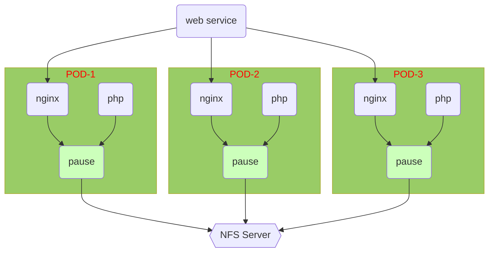

# kubernetes -- 04

## kubernetes 性能与监控

#### 部署metrics-server

###### 开启apiserver聚合服务

```yaml
[root@master ~]# vim /etc/kubernetes/manifests/kube-apiserver.yaml
# spec.containers.command 最下面手动添加如下一行
    - --enable-aggregator-routing=true
[root@master ~]# systemctl restart kubelet
[root@master ~]# kubectl -n kube-system get pod kube-apiserver-master -o yaml |grep enable-aggregator-routing
    - --enable-aggregator-routing=true
```

###### 证书的申请与签发

要在所有节点执行（master，node-0001，node-0002，node-0003）

申请的多余证书可以使用 （kubectl delete certificatesigningrequests 证书名称） 删除

```yaml
[root@node-0001 ~]# vim /var/lib/kubelet/config.yaml
# 在文件的最后一行添加
serverTLSBootstrap: true
[root@node-0001 ~]# systemctl restart kubelet
#-------------------------签发证书必须在 master 上执行 ------------------------------------
[root@master ~]# kubectl get certificatesigningrequests
NAME        AGE   REQUESTOR            CONDITION
csr-wsfz7   8s    system:node:master   Pending
[root@master ~]# kubectl certificate approve csr-wsfz7
[root@master ~]# kubectl get certificatesigningrequests
NAME        AGE   REQUESTOR            CONDITION
csr-wsfz7   86s   system:node:master   Approved,Issued
```

###### 安装mertics插件

拷贝 云盘的kubernetes/v1.17.6/metrics 目录到 master 上

```yaml
[root@master metrics]# docker load -i metrisc-server.tar.gz
[root@master metrics]# docker tag gcr.io/k8s-staging-metrics-server/metrics-server:master 192.168.1.100:5000/metrics-server:master
[root@master metrics]# docker push 192.168.1.100:5000/metrics-server:master
[root@master metrics]# vim deployment.yaml
29： image: 192.168.1.100:5000/metrics-server:master
[root@master metrics]# kubectl apply -f rbac.yaml
[root@master metrics]# kubectl apply -f pdb.yaml
[root@master metrics]# kubectl apply -f deployment.yaml
[root@master metrics]# kubectl apply -f service.yaml
[root@master metrics]# kubectl apply -f apiservice.yaml
#-------------------------------- 查询验证 ----------------------------------------------
[root@master metrics]# kubectl -n kube-system get pod
NAME                              READY   STATUS    RESTARTS   AGE
metrics-server-78dfb54777-4dcjl   1/1     Running   0          116s
[root@master metrics]# kubectl -n kube-system get apiservices
NAME                                   SERVICE                      AVAILABLE   AGE
v1beta1.metrics.k8s.io                 kube-system/metrics-server   True        2m20s
[root@master metrics]# kubectl top node
NAME        CPU(cores)   CPU%   MEMORY(bytes)   MEMORY%   
master      95m          4%     840Mi           48%       
node-0001   24m          1%     266Mi           15%       
node-0002   24m          1%     270Mi           15%       
node-0003   26m          1%     280Mi           16%   
```

#### 监控容器资源利用率

```shell
[root@master ~]# kubectl apply -f myapache.yaml 
deployment.apps/myapache created
[root@master ~]# kubectl top pod
error: metrics not available yet
# 等待大约 30 秒
[root@master ~]# kubectl top pod
NAME                       CPU(cores)   MEMORY(bytes)   
myapache-7d689bf8f-lfr5h   0m           0Mi   
[root@master ~]# curl http://10.244.2.17/info.php?id=5000000
<pre>
Array
(
    [REMOTE_ADDR] => 10.244.0.0
    [REQUEST_METHOD] => GET
    [HTTP_USER_AGENT] => curl/7.29.0
    [REQUEST_URI] => /info.php?id=5000000
    [id] => 5000000
)
php_host: 	myapache-7d689bf8f-lfr5h
[root@master ~]# kubectl top pod
NAME                       CPU(cores)   MEMORY(bytes)   
myapache-7d689bf8f-w4rtt   1000m        8Mi  
[root@master ~]# 
```

## 存储卷

#### configmap配置管理

###### 创建 configmap

由于 apache 与 nginx 都使用 80 端口，把之前的实验容器全部删除

```shell
[root@master ~]# mkdir /var/webconf
[root@master ~]# docker run -itd --name mynginx 192.168.1.100:5000/myos:nginx
9f719d0e797f81887b21985a31f426c1f2c48efd24a2c6666ecf41396fb99e93
[root@master ~]# docker cp mynginx:/usr/local/nginx/conf/nginx.conf /var/webconf/
[root@master ~]# docker rm -f mynginx
mynginx
[root@master ~]# ls -l /var/webconf/
total 4
-rw-r--r-- 1 root root 2656 Jul 25  2020 nginx.conf
[root@master ~]# vim /var/webconf/nginx.conf 
... ...
        location ~ \.php$ {
            root           html;
            fastcgi_pass   127.0.0.1:9000;
            fastcgi_index  index.php;
            include        fastcgi.conf;
        }
... ...
[root@master ~]# kubectl create configmap nginx-conf --from-file=/var/webconf/nginx.conf 
configmap/nginx-conf created
[root@master ~]# kubectl get configmaps 
NAME         DATA   AGE
nginx-conf   1      8s
[root@master ~]# 
```

###### 配置 configmap

在 yaml 中引用 configmap 定义

```yaml
[root@master ~]# vim webnginx.yaml
---
kind: Deployment
apiVersion: apps/v1
metadata:
  name: webnginx
spec:
  selector:
    matchLabels:
      myapp: nginx
  replicas: 1
  template:
    metadata:
      labels:
        myapp: nginx
    spec:
      volumes:                      # 新添加
      - name: nginx-php             # 新添加（标记1）
        configMap:                  # 新添加
          name: nginx-conf          # 新添加，必须与 configmap 命令创建的名称相同
      containers:
      - name: nginx
        image: 192.168.1.100:5000/myos:nginx
        volumeMounts:               # 新添加
        - name: nginx-php           # 新添加，必须与（标记1）名称相同
          subPath: nginx.conf       # 新添加
          mountPath: /usr/local/nginx/conf/nginx.conf     # 新添加
        ports:
        - protocol: TCP
          containerPort: 80
      restartPolicy: Always

[root@master ~]# kubectl apply -f webnginx.yaml 
deployment.apps/webnginx created
[root@master ~]# kubectl get pod 
NAME                        READY   STATUS    RESTARTS   AGE
webnginx-844859695b-5s7m7   1/1     Running   0          10s
[root@master ~]# kubectl exec -it webnginx-844859695b-5s7m7 -- /bin/bash
[root@webnginx-844859695b-5s7m7 html]# cat /usr/local/nginx/conf/nginx.conf
# 查看配置文件是否改变了
[root@webnginx-844859695b-kmwwh html]# ss -ltun
Netid  State      Recv-Q Send-Q      Local Address:Port      Peer Address:Port            
tcp    LISTEN     0      128                     *:80                   *:*                                
[root@webnginx-844859695b-kmwwh html]# exit
[root@master ~]# kubectl delete -f webnginx.yaml 
deployment.apps "webnginx" deleted
[root@master ~]# 
```

###### 添加 php 容器

```shell
[root@master ~]# vim webnginx.yaml
---
kind: Deployment
apiVersion: apps/v1
metadata:
  name: webnginx
spec:
  selector:
    matchLabels:
      myapp: nginx
  replicas: 1
  template:
    metadata:
      labels:
        myapp: nginx
    spec:
      volumes:
      - name: nginx-php
        configMap: 
          name: nginx-conf
      containers:
      - name: nginx
        image: 192.168.1.100:5000/myos:nginx
        volumeMounts:
        - name: nginx-php
          subPath: nginx.conf
          mountPath: /usr/local/nginx/conf/nginx.conf
        ports:
        - protocol: TCP
          containerPort: 80
      - name: php-backend                       # 新添加
        image: 192.168.1.100:5000/myos:php-fpm  # 新添加
      restartPolicy: Always

[root@master ~]# kubectl apply -f config/webnginx.yaml 
deployment.apps/webnginx created
[root@master ~]# kubectl get pod -o wide
NAME                        READY   STATUS    RESTARTS   AGE	IP            NODE      
webnginx-6c9f6fd675-7rmzk   2/2     Running   0          5s		10.244.2.25   node-0002
[root@master ~]# kubectl exec -it webnginx-6c9f6fd675-7rmzk -c nginx -- /bin/bash
[root@webnginx-6c9f6fd675-7rmzk html]# ss -ltun
Netid  State      Recv-Q Send-Q      Local Address:Port      Peer Address:Port              
tcp    LISTEN     0      128                     *:80                   *:*                  
tcp    LISTEN     0      128                     *:9000                 *:*
[root@webnginx-6c9f6fd675-7rmzk html]# exit
[root@master ~]# curl http://10.244.2.25/info.php
<pre>
Array
(
    [REMOTE_ADDR] => 10.244.0.0
    [REQUEST_METHOD] => GET
    [HTTP_USER_AGENT] => curl/7.29.0
    [REQUEST_URI] => /info.php
)
php_host: 	webnginx-6c9f6fd675-7rmzk
1229
[root@master ~]# 
```

#### emptydir 存储卷

```yaml
[root@master ~]# vim webcache.yaml 
---
kind: Deployment
apiVersion: apps/v1
metadata:
  name: webcache
spec:
  selector:
    matchLabels:
      myapp: cache
  replicas: 1
  template:
    metadata:
      labels:
        myapp: cache
    spec:
      volumes:                       # 新添加
      - name: empty-data             # 新添加
        emptyDir: {}                 # 新添加
      containers:
      - name: apache
        image: 192.168.1.100:5000/myos:httpd
        stdin: false
        tty: false
        volumeMounts:                # 新添加
        - name: empty-data           # 新添加
          mountPath: /var/cache      # 新添加
        ports:
        - protocol: TCP
          containerPort: 80
      restartPolicy: Always

[root@master ~]# kubectl apply -f webcache.yaml 
deployment.apps/webcache created
[root@master ~]# kubectl exec -it webcache-c58847c54-qw9lh -- /bin/bash
[root@webcache-c58847c54-qw9lh html]# df -h
Filesystem       Size   Used       Avail        Use%       Mounted on
/dev/vda1        40G    2.9G       35G          8%         /var/cache
... ...
[root@webcache-c58847c54-qw9lh html]# exit
[root@master ~]# 
```

#### hostpath 存储卷

```yaml
[root@master ~]# cat webcache.yaml 
---
kind: Deployment
apiVersion: apps/v1
metadata:
  name: webcache
spec:
  selector:
    matchLabels:
      myapp: cache
  replicas: 1
  template:
    metadata:
      labels:
        myapp: cache
    spec:
      volumes:
      - name: empty-data
        emptyDir: {}
      - name: log-data                # 新添加
        hostPath:                     # 新添加
          path: /var/weblog           # 新添加
          type: DirectoryOrCreate     # 新添加
      containers:
      - name: apache
        image: 192.168.1.100:5000/myos:httpd
        stdin: false
        tty: false
        volumeMounts:
        - name: empty-data
          mountPath: /var/cache
        - name: log-data             # 新添加
          mountPath: /var/log/httpd  # 新添加
        ports:
        - protocol: TCP
          containerPort: 80
      restartPolicy: Always
[root@master ~]# kubectl apply -f webcache.yaml 
deployment.apps/webcache created
[root@master ~]# kubectl get pod -o wide
NAME                        READY   STATUS    RESTARTS   AGE   IP            NODE
webcache-75588b9cc5-xzkvc   1/1     Running   0          4s    10.244.2.30   node-0002
[root@master ~]# curl http://10.244.2.30/
this is apache
[root@master ~]# ssh 192.168.1.32
root@192.168.1.32's password: 
Last login: Mon Apr 26 10:41:58 2021 from 192.168.1.252
Welcome to Huawei Cloud Service

[root@node-0002 ~]# ls -l /var/weblog/
total 16
-rw-r--r--   1 root root   86 Apr 26 13:12 access_log
-rw-r--r--   1 root root  489 Apr 26 13:12 error_log
[root@node-0002 ~]# cat /var/weblog/access_log 
10.244.0.0 - - [26/Apr/2021:05:12:59 +0000] "GET / HTTP/1.1" 200 15 "-" "curl/7.29.0"
[root@node-0002 ~]# 
```

#### 持久卷

###### 搭建NFS服务器

```shell
[root@registry ~]# yum install -y nfs-utils
[root@registry ~]# mkdir -m 777 /var/webroot
[root@registry ~]# vim  /etc/exports
/var/webroot	*(rw)
[root@registry ~]# systemctl enable --now nfs
#---------------------------------所有节点都需要 nfs 软件包-------------------------
[root@node-0001 ~]# yum install -y nfs-utils
#--------------------------------------------------------------------------------
[root@node-0002 ~]# yum install -y nfs-utils
#--------------------------------------------------------------------------------
[root@node-0003 ~]# yum install -y nfs-utils
#-------------------------------下面在任意其他节点测试------------------------------
[root@master ~]# yum install -y nfs-utils
[root@master ~]# showmount -e 192.168.1.100
Export list for 192.168.1.100:
/var/webroot *
[root@master ~]# 
```

###### 创建 pv

```yaml
[root@master ~]# vim mypv.yaml 
---
kind: PersistentVolume
apiVersion: v1
metadata:
  name: pv-nfs
spec:
  volumeMode: Filesystem
  capacity:
    storage: 30Gi
  accessModes:
  - ReadWriteOnce
  - ReadOnlyMany
  - ReadWriteMany
  persistentVolumeReclaimPolicy: Retain
  nfs:
    server: 192.168.1.100
    path: /var/webroot

[root@master ~]# kubectl apply -f mypv.yaml 
persistentvolume/pv-nfs created
[root@master ~]# kubectl get pv
NAME     CAPACITY   ACCESS MODES   RECLAIM POLICY   STATUS          AGE
pv-nfs   30Gi       RWO,ROX,RWX    Retain           Available       3s
```

###### 创建 pvc

```yaml
[root@master configmap]# vim mypvc.yaml 
---
kind: PersistentVolumeClaim
apiVersion: v1
metadata:
  name: pvc-nfs
spec:
  volumeMode: Filesystem
  accessModes:
  - ReadWriteMany
  resources:
    requests:
      storage: 25Gi

[root@master configmap]# kubectl apply -f mypvc.yaml
[root@master configmap]# kubectl get pv
NAME     CAPACITY   ACCESS MODES   RECLAIM POLICY   STATUS   CLAIM
pv-nfs   30Gi       RWX            Retain           Bound    default/pvc-nfs
[root@master configmap]# kubectl get pvc
NAME      STATUS   VOLUME   CAPACITY   ACCESS MODES   STORAGECLASS   AGE
pvc-nfs   Bound    pv-nfs   30Gi       RWO,ROX,RWX                   27s
```

###### 应用持久卷

```yaml
[root@master ~]# cat webnginx.yaml 
---
kind: Deployment
apiVersion: apps/v1
metadata:
  name: webnginx
spec:
  selector:
    matchLabels:
      myapp: nginx
  replicas: 1
  template:
    metadata:
      labels:
        myapp: nginx
    spec:
      volumes:
      - name: nginx-php
        configMap: 
          name: nginx-conf
      - name: website                     # 新添加
        persistentVolumeClaim:            # 新添加
          claimName: pvc-nfs              # 新添加
      containers:
      - name: nginx
        image: 192.168.1.100:5000/myos:nginx
        volumeMounts:
        - name: nginx-php
          subPath: nginx.conf
          mountPath: /usr/local/nginx/conf/nginx.conf
        - name: website                     # 新添加
          mountPath: /usr/local/nginx/html  # 新添加
        ports:
        - protocol: TCP
          containerPort: 80
      - name: php-backend
        image: 192.168.1.100:5000/myos:php-fpm
        volumeMounts:                       # 新添加
        - name: website                     # 新添加
          mountPath: /usr/local/nginx/html  # 新添加
      restartPolicy: Always

[root@master ~]# kubectl delete -f webnginx.yaml 
deployment.apps "webnginx" deleted
[root@master ~]# kubectl apply -f webnginx.yaml 
deployment.apps/webnginx created
[root@master ~]# kubectl get pod -o wide
NAME                       READY   STATUS    RESTARTS   AGE   IP            NODE
webnginx-d488b9447-t62cl   2/2     Running   0          7s    10.244.2.32   node-0002
[root@master ~]# curl http://10.244.2.32/
# 在 nfs 上创建修改页面，然后在容器端访问测试
```

#### nginx+php部署图例

###### 集群部署案例



###### 综合实验

```yaml
[root@master ~]# cat webcluster.yaml 
---
kind: PersistentVolume
apiVersion: v1
metadata:
  name: pv-nfs
spec:
  volumeMode: Filesystem
  capacity:
    storage: 30Gi
  accessModes:
  - ReadWriteOnce
  - ReadOnlyMany
  - ReadWriteMany
  persistentVolumeReclaimPolicy: Retain
  nfs:
    server: 192.168.1.100
    path: /var/webroot

---
kind: PersistentVolumeClaim
apiVersion: v1
metadata:
  name: pvc-nfs
spec:
  volumeMode: Filesystem
  accessModes:
  - ReadWriteMany
  resources:
    requests:
      storage: 25Gi

---
kind: ConfigMap
apiVersion: v1
metadata:
  name: nginx-conf
data:
  nginx.conf: |2

    #user  nobody;
    worker_processes  1;

    #error_log  logs/error.log;
    #error_log  logs/error.log  notice;
    #error_log  logs/error.log  info;

    #pid        logs/nginx.pid;


    events {
        worker_connections  1024;
    }


    http {
        include       mime.types;
        default_type  application/octet-stream;

        #log_format  main  '$remote_addr - $remote_user [$time_local] "$request" '
        #                  '$status $body_bytes_sent "$http_referer" '
        #                  '"$http_user_agent" "$http_x_forwarded_for"';

        #access_log  logs/access.log  main;

        sendfile        on;
        #tcp_nopush     on;

        #keepalive_timeout  0;
        keepalive_timeout  65;

        #gzip  on;

        server {
            listen       80;
            server_name  localhost;

            #charset koi8-r;

            #access_log  logs/host.access.log  main;

            location / {
                root   html;
                index  index.html index.htm;
            }

            #error_page  404              /404.html;

            # redirect server error pages to the static page /50x.html
            #
            error_page   500 502 503 504  /50x.html;
            location = /50x.html {
                root   html;
            }

            # proxy the PHP scripts to Apache listening on 127.0.0.1:80
            #
            #location ~ \.php$ {
            #    proxy_pass   http://127.0.0.1;
            #}

            # pass the PHP scripts to FastCGI server listening on 127.0.0.1:9000
            #
            location ~ \.php$ {
                root           html;
                fastcgi_pass   127.0.0.1:9000;
                fastcgi_index  index.php;
                include        fastcgi.conf;
            }

            # deny access to .htaccess files, if Apache's document root
            # concurs with nginx's one
            #
            #location ~ /\.ht {
            #    deny  all;
            #}
        }


        # another virtual host using mix of IP-, name-, and port-based configuration
        #
        #server {
        #    listen       8000;
        #    listen       somename:8080;
        #    server_name  somename  alias  another.alias;

        #    location / {
        #        root   html;
        #        index  index.html index.htm;
        #    }
        #}


        # HTTPS server
        #
        #server {
        #    listen       443 ssl;
        #    server_name  localhost;

        #    ssl_certificate      cert.pem;
        #    ssl_certificate_key  cert.key;

        #    ssl_session_cache    shared:SSL:1m;
        #    ssl_session_timeout  5m;

        #    ssl_ciphers  HIGH:!aNULL:!MD5;
        #    ssl_prefer_server_ciphers  on;

        #    location / {
        #        root   html;
        #        index  index.html index.htm;
        #    }
        #}

    }

---
kind: Deployment
apiVersion: apps/v1
metadata:
  name: webnginx
spec:
  selector:
    matchLabels:
      myapp: nginx
  replicas: 3
  template:
    metadata:
      labels:
        myapp: nginx
    spec:
      volumes:
      - name: nginx-php
        configMap: 
          name: nginx-conf
      - name: log-data
        hostPath:
          path: /var/log/weblog
          type: DirectoryOrCreate
      - name: website
        persistentVolumeClaim:
          claimName: pvc-nfs
      containers:
      - name: nginx
        image: 192.168.1.100:5000/myos:nginx
        volumeMounts:
        - name: nginx-php
          subPath: nginx.conf
          mountPath: /usr/local/nginx/conf/nginx.conf
        - name: log-data
          mountPath: /usr/local/nginx/logs
        - name: website
          mountPath: /usr/local/nginx/html
        ports:
        - protocol: TCP
          containerPort: 80
      - name: php-backend
        image: 192.168.1.100:5000/myos:php-fpm
        volumeMounts:
        - name: website
          mountPath: /usr/local/nginx/html
      restartPolicy: Always

---
kind: Service
apiVersion: v1
metadata:
  name: webcluster
spec:
  ports:
  - protocol: TCP
    port: 80
    targetPort: 80
  selector:
    myapp: nginx
  type: ClusterIP

---
apiVersion: extensions/v1beta1
kind: Ingress
metadata:
  name: myweb
  annotations:
    kubernetes.io/ingress.class: "nginx"
spec:
  backend:
    serviceName: webcluster
    servicePort: 80

[root@master ~]# kubectl apply -f webcluster.yaml 
persistentvolume/pv-nfs created
persistentvolumeclaim/pvc-nfs created
configmap/nginx-conf created
deployment.apps/webnginx created
service/webcluster created
ingress.extensions/myweb created
[root@master ~]# kubectl get pod
NAME                       READY   STATUS    RESTARTS   AGE
webnginx-647877b59-hdb64   2/2     Running   0          11s
webnginx-647877b59-ljb6g   2/2     Running   0          11s
webnginx-647877b59-rqmdr   2/2     Running   0          11s
[root@master ~]# kubectl get ingresses
NAME    HOSTS   ADDRESS        PORTS   AGE
myweb   *       192.168.1.31   80      17s
[root@master ~]# # 给 node-0001 绑定弹性公网IP，或使用 ELB 发布到互联网即可验证
```


